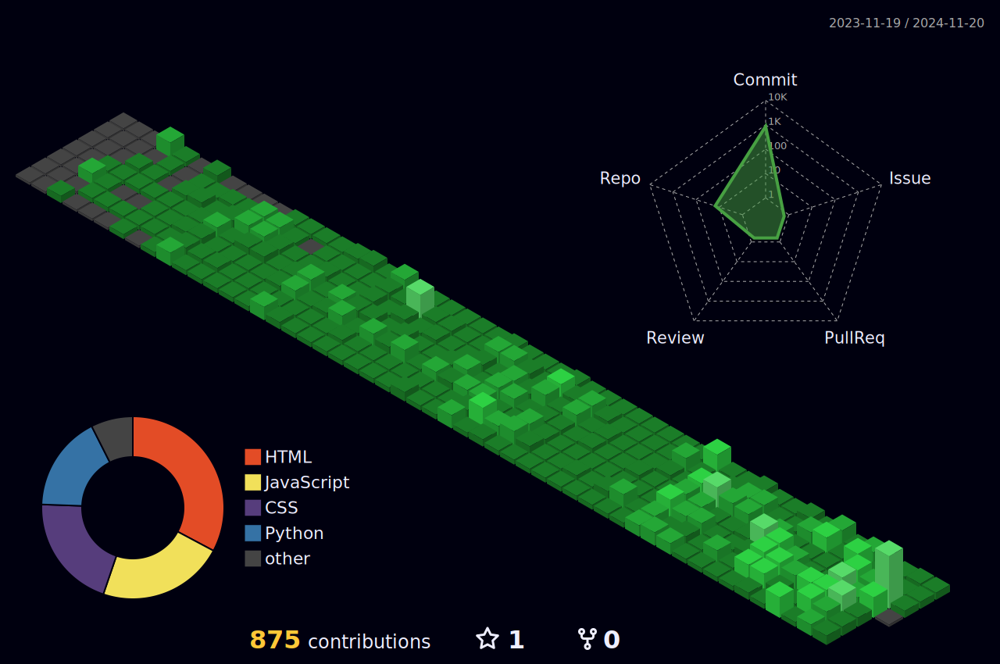

### Hello🖐 I'm Suyoung Jung, a front-end developer who is interested in realizing business value.
#### 🗂️ Portfolio [www.jungsuyoung.com](https://www.jungsuyoung.com)
#### 🗂️ Resume [Resume](https://www.notion.so/Walker-13d94cea3cfc80c59f12e90c8b1a87c3)
#### 🗂️ Techblog [https://walkersdevlog.vercel.app/](https://walkersdevlog.vercel.app/)

## Contributions

## Tech Stack
        

## Work Experience
- **Hana TI** (Nov 2023 - Aug 2024)
  - Infrastructure Engineer, Hana Bank Infrastructure Maintenance Officer 

## Project
- **Tech Blog** (Jan 2025)
  - Tech blog for knowledge sharing such as CS knowledge, algorithms, project issue resolution, etc
  - HTML, CSS, Javascript, React, NextJS, AWS S3, MongoDB
  - [https://walkersdevlog.vercel.app/](https://walkersdevlog.vercel.app)

- **Portfolio site** (Oct 2024)
  - created a portfolio site with vanilla JavaScript
  - HTML, CSS, Javascript, AWS S3, AWS CloudFront
  - [https://www.jungsuyoung.com/](https://www.jungsuyoung.com)

- Graduation product : **"Effortless Insurance Processing"** (Oct 2023)
  - Developed an end-to-end solution for seamless insurance processes, covering sign-up, assessment, and billing.
  - Spingboot, Java, HTML, CSS, Javascript, Oracle DBMS
  - https://github.com/jsy8315/1Q_Insurance

  
## Education
- Gwangmyeong Convergence Technology campus of Korea Polytechnic (Nov 2023)
  - Participated in the Hana TI recruitment-linked education program
 
- The Catholic University of Korea (Feb 2023)
  - Bachelor of Science in Nursing

<!--
## PS tier

-->
Feel free to explore my repositories for more projects and contributions. If you have any questions or exciting collaboration opportunities, feel free to reach out!

Happy coding! 🚀🚀

