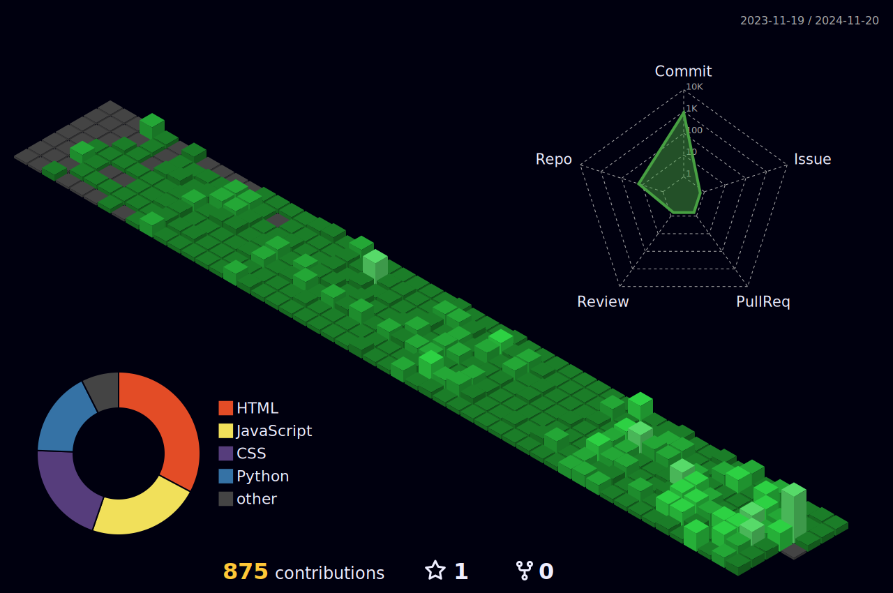

### Hello🖐 I'm Jung Suyoung, a front-end developer who is interested in realizing business value.
🗂️ [jungsuyoung.com](http://jungsuyoung.com/){:target="_blank"}

## Contributions

## Tech Stack
    

## Work Experience
- Hana TI (Nov 2023 - Aug 2024)
  - Infrastructure Engineer, Hana Bank Infrastructure Maintenance Officer

## Project
- Graduation product : **"Effortless Insurance Processing"**
  - Developed an end-to-end solution for seamless insurance processes, covering sign-up, assessment, and billing. 

  
## Education
- Gwangmyeong Convergence Technology campus of Korea Polytechnic (Nov 2023)
  - Participated in the Hana TI recruitment-linked education program
 
- The Catholic University of Korea (Feb 2023)
  - Bachelor of Science in Nursing

<!--
## PS tier

-->
Feel free to explore my repositories for more projects and contributions. If you have any questions or exciting collaboration opportunities, feel free to reach out!

Happy coding! 🚀✈️
